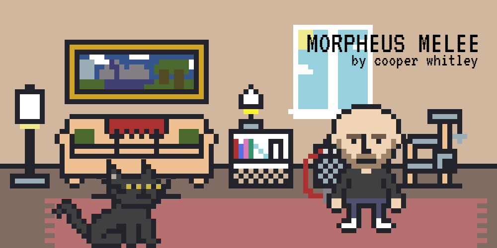
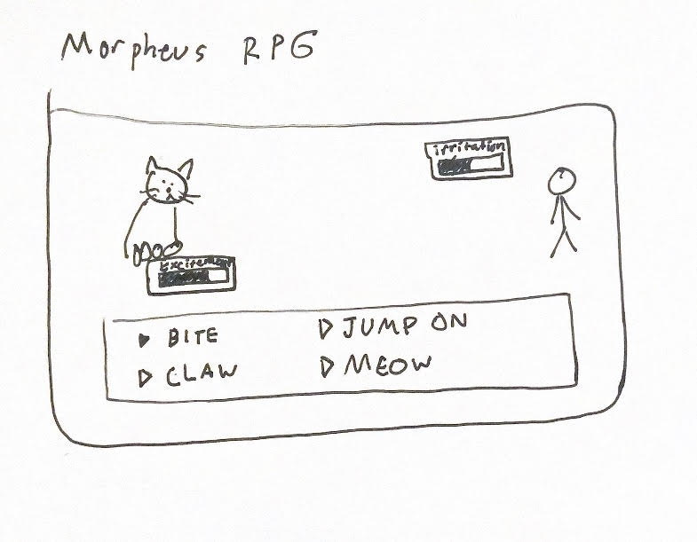
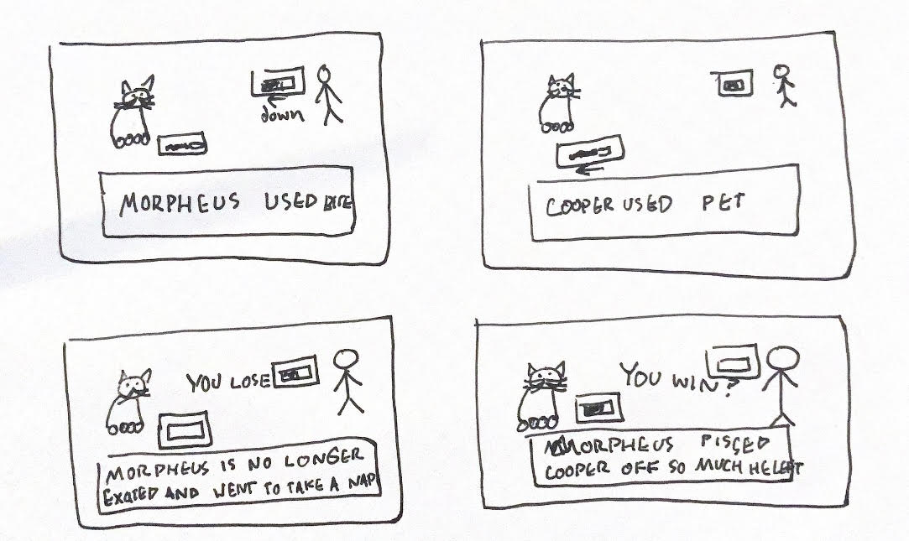
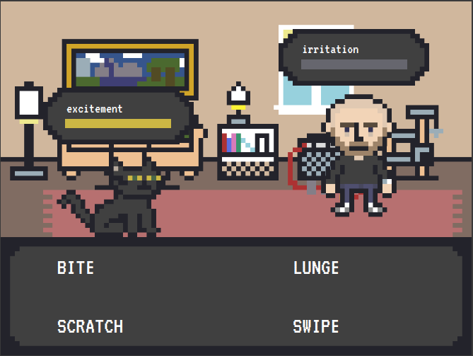
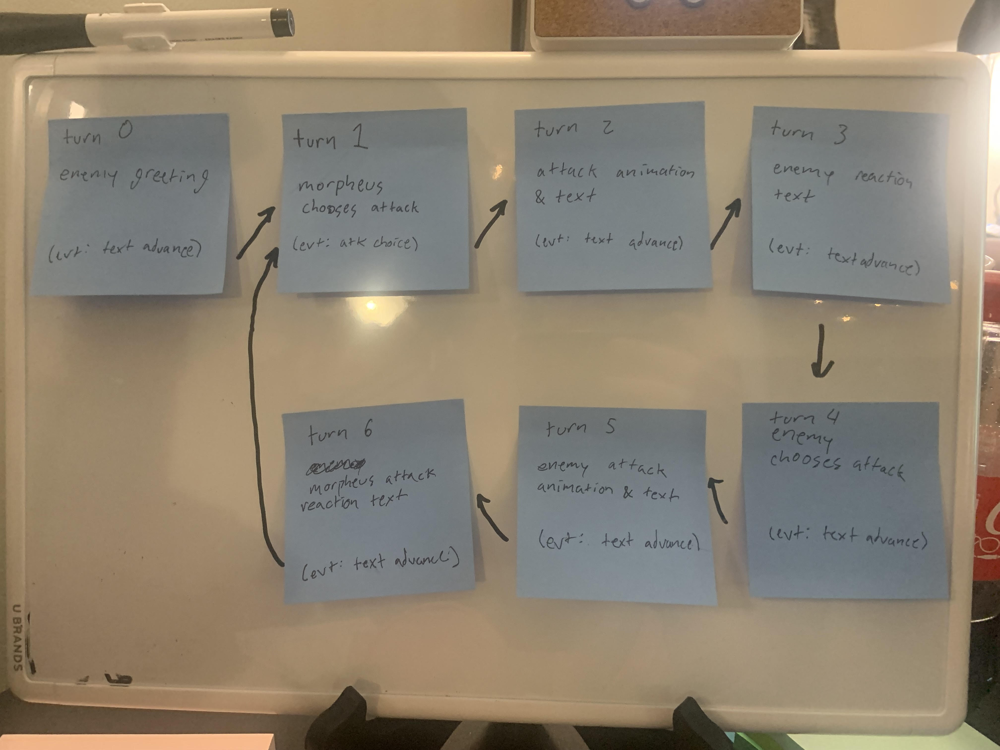
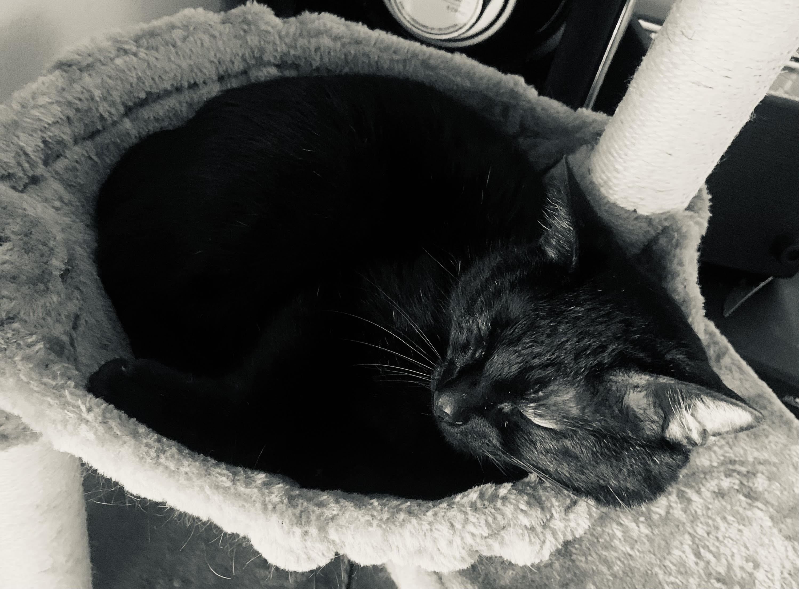

# Morpheus Melee
###### by Cooper Whitley

## Overview
My cat is an asshole. Whose isn't? This is how I think he sees the world when he goes from loving to fight mode. A micro JRPG about a cat biting the hand that feeds him.
#### Technologies Used
- Html
- CSS
- JavaScript
- Aseprite
- Avid Pro Tools
## User Stories
#### Minimum Viable Product
As a user...
- I want to control a character (Morpheus)
- I want there to be an enemy character (Cooper)
- I want both characters to have a health bar, that when depleted ends the game
- I want Morpheus' health to be called excitement, and when it runs out for him to give up and take a nap (lose condition)
- I want the enemy's health to be called irritation, and when it runs out for them to get annoyed and leave or banish Morpheus from the room (win condition?)
- I want to take turns acting
- I want to choose from a list of attacks that deplete health
- I want the enemy character to also choose from a list of attacks that deplete health
- I want to have a visual display of stats like health/attack damage
- I want to see all of this in a retro Pokemon/Final Fantasy style fight screen, with pixel art sprites to represent the characters
- I want to see flavor text dialogue describing the move choices as they happen
- I want to see basic movement animations
#### Stretch Goals (Listed in order of implementation difficulty)
As a demanding user...
- I want to be able to attack Cooper's girlfriend and other roommates, and choose which one of them I do
- I want more variable stats such as attack, defense, sleepiness, and malice
- I want more complex moves such as playing with a toy, pretending to be sweet, getting fed, and getting held/petted and for those moves to alter the various stats other than simply causing damage
- I want animated sprites, a background for the fight, as well as nested menus for stats and move types
- I want a charge move that takes more than one turn to happen
- I want bespoke sound effects and a soundtrack that suits the retro style
- I want a separate screen to explore the apartment to choose a target
- I want the explorable apartment to have other interactable elements
## Wireframe
#### First Wireframes

#### Functioning Layout Wireframe

#### Planning Wireframes

## Morby

